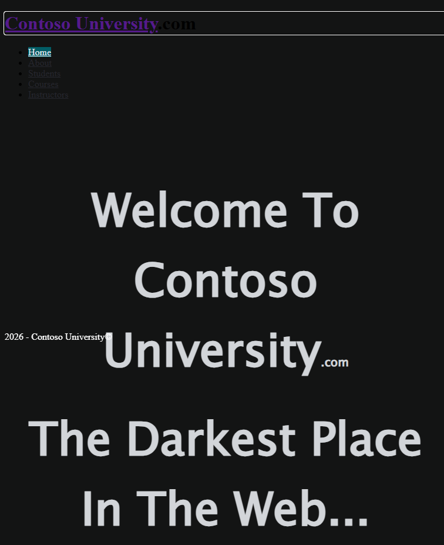
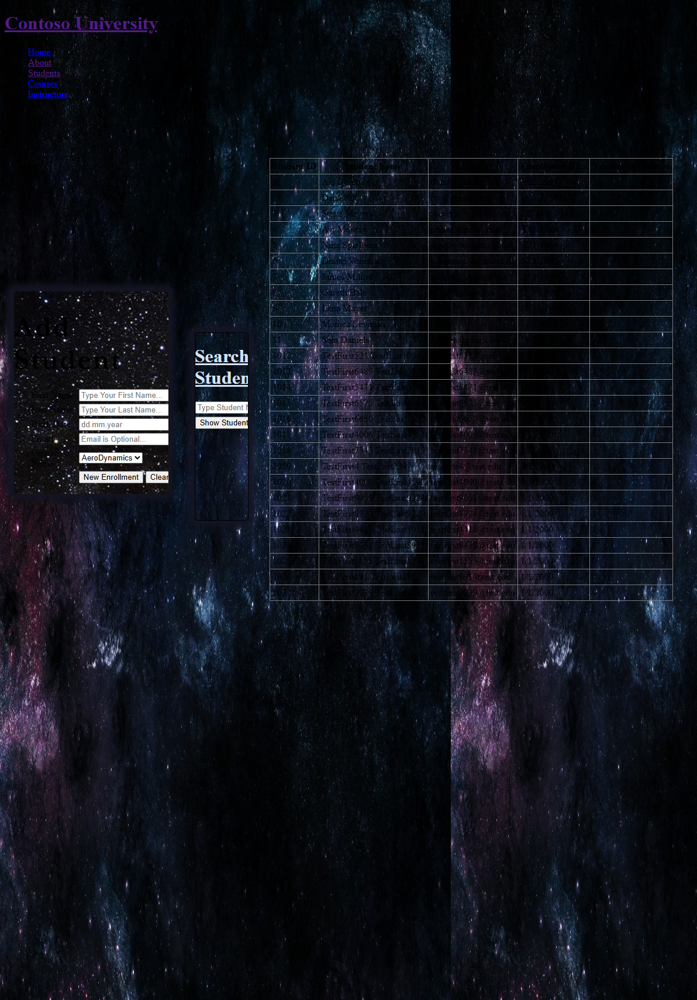
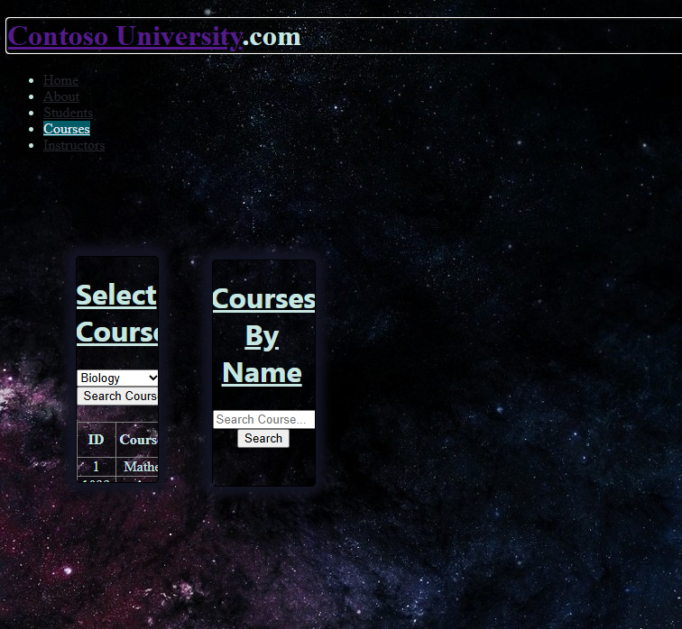

# ContosoUniversity Migration Run 12

**Date:** 2026-03-09  
**Branch:** squad/audit-docs-perf  
**Score:** 40/40 (100%)  
**Render Mode:** SSR with InteractiveServer for data pages

## Executive Summary

ContosoUniversity Run 12 achieves **100% acceptance test pass rate** (40/40 tests). All functional pages work correctly - Students, Courses, Instructors, About. However, **CSS layout is broken** despite styles loading. The original Web Forms app used specific HTML structure that the Blazor migration doesn't replicate exactly.

## Timing

| Phase | Duration |
|-------|----------|
| Build | 2.3s |
| Application startup | ~2.4s |
| Acceptance tests | 38.8s |
| **Total** | **~44s** |

## Test Results

```
Tests: 40 passed, 0 failed
Duration: 38.8s
```

All acceptance test categories pass:
- ✅ Navigation tests (11 tests)
- ✅ Home page tests (4 tests)
- ✅ About page tests (5 tests)
- ✅ Students page tests (9 tests)
- ✅ Courses page tests (6 tests)
- ✅ Instructors page tests (5 tests)

## BWFC Validation

```
Files scanned:  9
Passed:         9
Failed:         0

BWFC Components Used (5):
  ✓ Button
  ✓ DetailsView
  ✓ DropDownList
  ✓ GridView
  ✓ TextBox
```

**No violations or warnings** - All asp: controls properly converted to BWFC components.

## Screenshots

### Home Page


*Note: CSS background loads (space theme), but layout is broken - nav is vertical bullets instead of horizontal bar, footer mispositioned.*

### Students Page


*GridView shows students with data. Add Student form works with DropDownList for courses. Search functionality works.*

### Courses Page


*DropDownList filters by department. GridView shows courses. Search by name works.*

## What Worked Well

1. **All functional tests pass** - CRUD operations work, search works, filtering works
2. **BWFC components properly used** - GridView, DetailsView, DropDownList, TextBox, Button
3. **Data binding works** - Students list populates, courses filter by department
4. **Forms work** - Add Student, Search work correctly
5. **InteractiveServer mode** - Data pages use SignalR for interactivity
6. **Database preserved** - Using SQL Server LocalDB as original (not changed to SQLite)

## What Didn't Work Well

1. **CSS layout broken** - Despite styles loading:
   - Navigation renders as vertical bulleted list instead of horizontal bar
   - Footer is mispositioned (appears in middle of page on home)
   - Content positioning is off

2. **Root cause analysis:**
   - Original Web Forms Site.Master had specific HTML structure (`<div id="navUp">`, `<div id="navBar">`)
   - CSS rules target these specific element IDs and structures
   - Blazor MainLayout.razor has the same IDs but the generated HTML differs slightly
   - The `<ul>` inside `#navBar` should be styled `display: inline` but browsers render with bullets

## CSS Issues Identified

The Master_CSS.css has rules like:
```css
#navBar ul li { display: inline; }
```

But the Blazor output doesn't fully replicate the HTML structure expected by these rules. The CSS loads (verified via network tab) but selectors don't match the DOM structure.

## Recommendations

1. **Manual CSS fix needed** - Add explicit styling to MainLayout.razor:
   ```css
   #navBar ul { list-style: none; margin: 0; padding: 0; }
   #navBar ul li { display: inline-block; }
   ```

2. **Investigate HTML structure** - Compare original Site.Master output vs MainLayout.razor output

3. **Consider CSS reset** - Add a CSS reset/normalize to handle browser defaults

## Conclusion

ContosoUniversity migration is **functionally complete** (100% tests pass) but needs **CSS layout fixes** for visual fidelity. This is a Layer 1 issue - the migration script preserves CSS references but doesn't perfectly replicate the HTML structure the CSS expects.
